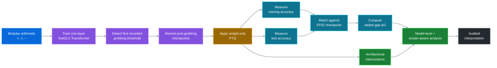
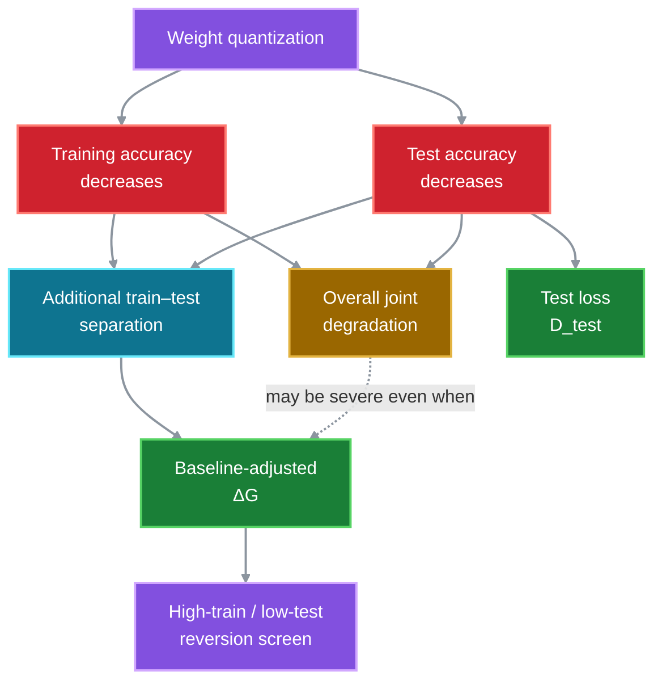
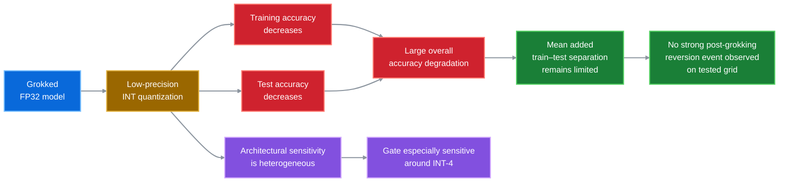
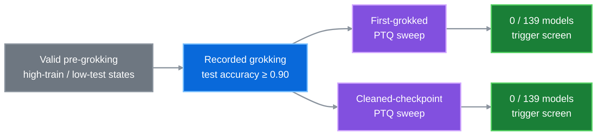
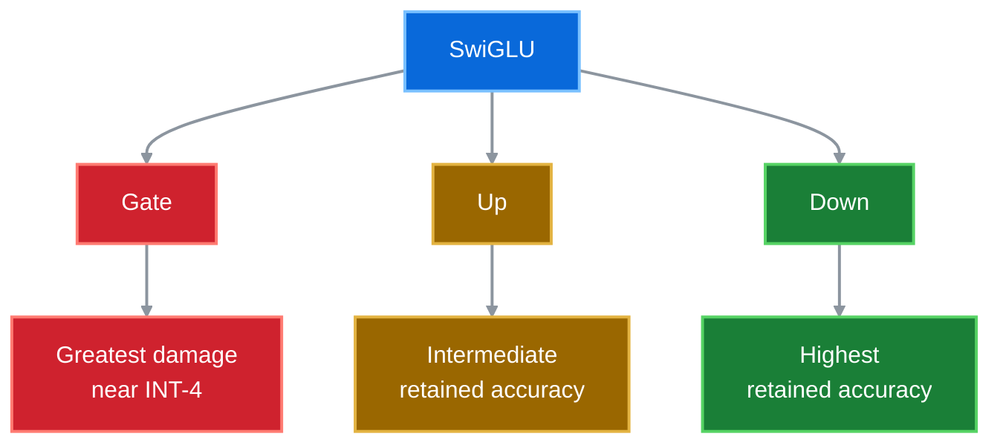
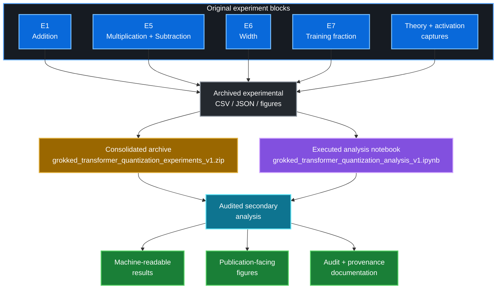
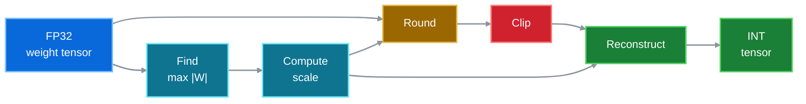
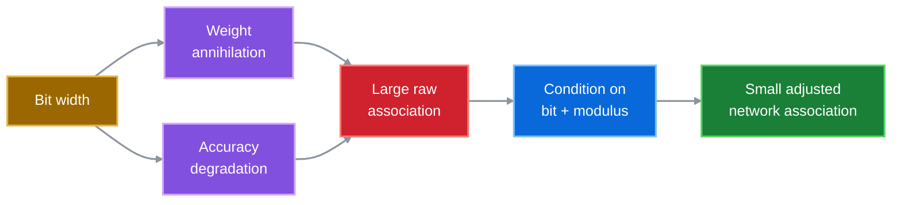
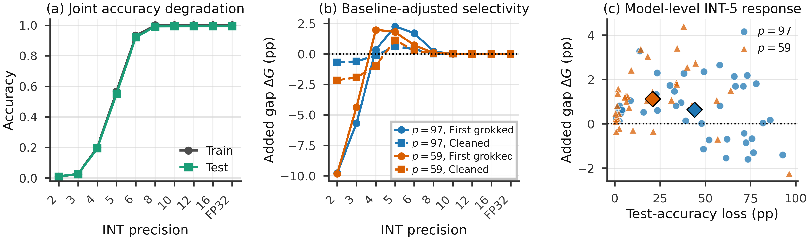
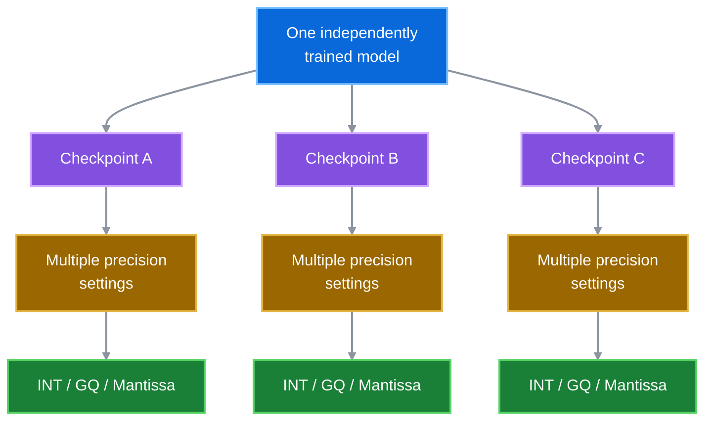

<h1 align="center">Grokked Transformer Quantization</h1>

<h2 align="center">
Train–Test Selectivity and Architectural Fragility<br>
Under Quantization of Grokked Transformers
</h2>

<p align="center">
  <strong>Research artifact · Experimental record · Reproducibility repository</strong>
</p>

<p align="center">
  <strong>Md Muntaqim Meherab · Mahathir Muhammad</strong><br>
  Daffodil International University, Dhaka, Bangladesh
</p>

<p align="center">
  
  
  
  
  
</p>

<p align="center">
  
</p>

<p align="center">
  <a href="#research-question">Research question</a> ·
  <a href="#research-pipeline">Pipeline</a> ·
  <a href="#model-architecture">Architecture</a> ·
  <a href="#audited-interpretation">Findings</a> ·
  <a href="#publication-facing-main-figures">Figures</a> ·
  <a href="#repository-layout">Repository</a> ·
  <a href="#reproducing-the-artifact">Reproducibility</a> ·
  <a href="#citation">Citation</a>
</p>

---

> [!IMPORTANT]
> **Manuscript status.** This repository accompanies a research manuscript.  
> Its existence does **not** imply acceptance or publication by any journal or conference.

This repository contains the executed experiment notebooks, archived datasets,
consolidated numerical exports, publication-facing figures, machine-readable
results, provenance records, and reproducibility documentation for our study
of post-training quantization (PTQ) in grokked transformers.

The repository deliberately distinguishes:

- independently trained models;
- repeated quantization measurements;
- checkpoint-level evaluations;
- separately retrained capture experiments;
- secondary analyses performed on archived numerical records;
- publication-facing evidence;
- historical notebook artifacts retained for provenance.

---

## Research at a glance

| Experimental dimension | Audited scope |
|:---|---:|
| E1/E5 training attempts | **180** |
| Models reaching the recorded grokking criterion | **139** |
| Repeated E1/E5 PTQ accuracy rows | **23,730** |
| Arithmetic tasks | **3** |
| Prime moduli | **2** |
| Quantization operators | **3** |
| Main publication figures | **5** |
| Audited supplementary figures | **7** |
| Default transformer depth | **1 transformer block** |
| Default model width | **128** |
| Attention heads | **4** |
| Default SwiGLU width | **341** |

---

## Research question

We ask:

> **Does untargeted post-training weight quantization preferentially damage
> the generalization acquired during grokking, or do training and test
> performance mainly degrade together?**

The experiments use one-layer causal SwiGLU transformers trained separately
on:

- modular addition;
- modular multiplication;
- modular subtraction.

The tested prime moduli are:

```text
p ∈ {59, 97}
```

The study focuses on the distinction between **overall accuracy loss** and
**additional train–test separation caused by quantization**.

---

## Research pipeline



---

## Core selectivity estimand

A checkpoint can already possess a train–test gap before quantization.
Therefore, the raw gap after quantization is **not** interpreted as entirely
quantization-induced selectivity.

For checkpoint `θ` and quantizer `Q_b`:

```text
Quantized train–test gap:

G_Q(b) = 100 × [acc_train(Q_b θ) − acc_test(Q_b θ)]
```

The matching full-precision gap is:

```text
G_0 = 100 × [acc_train(θ) − acc_test(θ)]
```

The primary selectivity estimand is:

```text
ΔG(b) = G_Q(b) − G_0
```

> [!NOTE]
> **Interpretation.** `ΔG > 0` means that quantization causes more
> *additional* damage to test accuracy than to training accuracy.

Overall test-accuracy loss is measured separately:

```text
D_test(b) = 100 × [acc_test(θ) − acc_test(Q_b θ)]
```

A large test-accuracy drop therefore does **not**, by itself, demonstrate
selective destruction of generalization.

---

## Why this distinction matters



---

## Model architecture

The default model is a one-layer causal transformer with:

- `d_model = 128`;
- four attention heads;
- head width `32`;
- SwiGLU feed-forward width `d_ff = 341`;
- no biases;
- no layer normalization.

Its feed-forward computation is:

```text
MLP(x) = W_d [ SiLU(W_g x) ⊙ (W_u x) ]
```

### Architecture and projection-level intervention design

<p align="center">
  
</p>

The publication-facing schematic shows the actual three-token input
`[a, b, =]`, the one-layer causal transformer with a SwiGLU feed-forward
block, and the isolated projection-level intervention protocol used for the
architectural analysis.

For the projection experiment, the cleaned FP32 checkpoint comes from a
model that had previously crossed the recorded grokking threshold. Gate
`W_g`, Up `W_u`, or Down `W_d` is INT-quantized **one projection at a time**
while all remaining parameters stay at full precision. Retained test accuracy
is then compared within the same trained models. The principal architectural
comparison reported in the manuscript uses **INT-4**.

Gate, Up, and Down are kept visually separate because the experiments reveal
substantial **projection-dependent numerical sensitivity**. The intervention
design measures numerical vulnerability; it does not by itself identify a
unique causal circuit for generalization.

---

## Main empirical picture



---

## Audited interpretation

Across the tested untargeted weight-only numerical perturbations,
substantial low-precision accuracy loss is usually **joint**: training and
test performance degrade together rather than producing a stable
high-training/low-test post-grokking reversal.

For the primary cleaned addition condition at `p = 97`:

| Quantity | Value |
|:---|---:|
| Models | **40** |
| FP32 mean train accuracy | **0.9988** |
| FP32 mean test accuracy | **0.9925** |
| INT-5 mean train accuracy | **0.5651** |
| INT-5 mean test accuracy | **0.5525** |
| Approximate test-accuracy loss | **44.0 pp** |
| Mean added gap ΔG | **+0.629 pp** |
| Selected-maximum model-bootstrap interval | **[0.337, 1.016] pp** |

At the first recorded grokking checkpoint for the same condition:

```text
Maximum mean added gap:
2.254 pp

Exploratory selected-maximum interval:
[1.801, 2.758] pp
```

> **Severe quantization damage does not automatically imply strong
> differential damage to generalization.**

Individual-model analyses nevertheless show that some networks exhibit
larger differential responses than the mean curve.

The conclusions therefore concern the defined group-level estimands and
event screens—not a claim that every model has negligible `ΔG`.

---

## Strong selective-reversion screen

The retrospective strong screen requires:

```text
quantized training accuracy ≥ 0.90
AND
quantized test accuracy ≤ 0.50
```

Among the **139 E1/E5 models that previously reached the recorded grokking
criterion**, no model triggers this screen at either recorded post-grokking
endpoint in the archived sweep.



| Endpoint | Eligible previously grokked models | Models triggering screen |
|:---|---:|---:|
| First-grokked checkpoint | 139 | **0** |
| Cleaned checkpoint | 139 | **0** |

> [!NOTE]
> High-training/low-test states observed before grokking are **not**
> PTQ-induced reversion. Those models had not yet generalized.

---

## Individual-model heterogeneity

A small maximum of the **mean** response does not imply that every
individual model has a small maximum response.

For addition under INT:

| Modulus | Phase | Median model max ΔG | 90th percentile | Largest observed |
|:---:|:---|---:|---:|---:|
| 97 | First grokked | 3.688 pp | 5.023 pp | 6.302 pp |
| 97 | Cleaned | 1.161 pp | 2.302 pp | 3.274 pp |
| 59 | First grokked | 3.048 pp | 4.928 pp | 5.931 pp |
| 59 | Cleaned | 1.218 pp | 3.201 pp | 4.388 pp |

This heterogeneity is compatible with the zero strong-screen result because
larger added gaps can occur at precision settings where training accuracy is
also substantially damaged.

---

## Architectural fragility

Numerical sensitivity is strongly heterogeneous across parameter groups.

For isolated four-bit INT quantization of SwiGLU projections:

| Modulus | Models | Gate | Up | Down |
|---:|---:|---:|---:|---:|
| p = 97 | 40 | **0.5561** | 0.7512 | 0.8915 |
| p = 59 | 36 | **0.8459** | 0.9503 | 0.9653 |

Lower test accuracy indicates greater damage.



This establishes **heterogeneous numerical intervention sensitivity**.

It does **not** establish that the Gate projection is the unique circuit
responsible for generalization.

---

## Cross-task robustness

At cleaned checkpoints, the fixed INT-5 comparison gives:

| Task | p | Models | FP32 test | INT-5 test | Added gap ΔG |
|:---|---:|---:|---:|---:|---:|
| Addition | 97 | 40 | 0.9925 | 0.5525 | +0.629 pp |
| Addition | 59 | 36 | 0.9772 | 0.7682 | +1.121 pp |
| Multiplication | 97 | 25 | 0.9754 | 0.4071 | −0.731 pp |
| Multiplication | 59 | 22 | 0.9630 | 0.6781 | −0.206 pp |
| Subtraction | 97 | 14 | 0.9558 | 0.5341 | +0.122 pp |
| Subtraction | 59 | 2 | 0.9990 | 0.7001 | +4.428 pp |

All six configurations show substantial test-performance damage.

The **sign and magnitude of ΔG are heterogeneous**, however.

> [!CAUTION]
> The subtraction `p = 59` result contains only **two eligible models** and
> should be interpreted descriptively rather than as a stable task-level
> estimate.

---

## What the experiments support

| Supported by the experiments | Not established by the experiments |
|:---|:---|
| Low-precision PTQ can severely reduce accuracy | Quantization universally destroys grokking |
| Training and test accuracy commonly degrade together | Memorization and generalization are structurally inseparable |
| Mean added separation is generally limited but heterogeneous | Every individual model has negligible selectivity |
| SwiGLU projections differ substantially in numerical sensitivity | Gate weights uniquely encode generalization |
| Raw annihilation and degradation co-vary strongly with precision | Small-weight annihilation independently causes the observed loss |
| No strong post-grokking reversion event occurs on the tested grid | No possible targeted intervention can selectively impair generalization |

---

## Experimental scope

| Block | Training attempts / records | Reached recorded grokking criterion | Scope |
|:---|---:|---:|:---|
| **E1 addition** | 80 | 76 | p=97: 40/40; p=59: 36/40 |
| **E5 multiplication** | 50 | 47 | p=97: 25/25; p=59: 22/25 |
| **E5 subtraction** | 50 | 16 | p=97: 14/25; p=59: 2/25 |
| **E6 width** | 40 | 40 | Five feed-forward widths; eight model seeds each |
| **E7 training fraction** | 60 | 30 | Training fractions 0.2, 0.3, and 0.4 |

The E1/E5 exports contain:

```text
23,730 repeated PTQ accuracy rows
```

These rows are repeated measurements across:

- model;
- task;
- modulus;
- checkpoint;
- quantizer;
- precision.

They must **not** be interpreted as 23,730 independent model replications.

---

## Experiment and data lineage



---

## Quantization operators

The archived evaluations contain three simulated **weight-only numerical
operators**.

### 1. Symmetric per-tensor integer quantization

For nominal precision `b`:

```text
q_b = 2^(b − 1) − 1

M = max |W|

s_b = M / q_b
```

The executed tensor transformation is conceptually:

```text
W
↓
divide by scale
↓
round to nearest integer
↓
clip to symmetric integer grid
↓
multiply by scale
↓
quantized W
```



---

### 2. Gaussian-quantile quantization

The notebook's Gaussian-quantile implementation uses:

```text
L_b = min(2^b, 256)
```

representatives based on normal quantiles and scaled by the tensor's sample
standard deviation.

The archived CSV label `nf` refers to this implementation.

> [!WARNING]
> This operator must **not** be interpreted as standard QLoRA NF4.

The settings:

```text
b ∈ {8, 10, 12, 16}
```

share the same capped 256-level codebook.

---

### 3. Simulated mantissa rounding

The simulated mantissa operator preserves:

- sign;
- exponent-derived scale;

while rounding the significand to `b` fractional bits.

Therefore, equal nominal `bits` labels across INT, GQ, and mantissa do
**not** correspond to equal physical storage budgets.

In particular:

```text
mantissa b = 2
```

is **not** equivalent to a packed two-bit weight representation.

---

### Full-precision reference

For all three schemes:

```text
bits = 23
```

is an explicit **unchanged full-precision bypass**.

It should not be interpreted as an experimentally quantized 23-bit model.

---

## Mechanism-analysis caution

One archived raw analysis produces an annihilation/degradation rank
association of approximately:

```text
Spearman ρ ≈ 0.87
```

However, precision level strongly co-varies with both quantities.



After conditioning on bit width and modulus, the corresponding
network-level associations are small.

The repository therefore does **not** interpret weight annihilation as a
verified independent causal explanation for the observed PTQ behavior.

---

## Publication-facing main figures

The current manuscript uses **five** main publication-facing figures. The
repository provides high-resolution PNG versions for visualization and vector
PDF versions where they are present in the corresponding `pdf/` directory.

The architecture/intervention schematic is displayed above in the
[Model architecture](#model-architecture) section because that is where it is
most useful to readers: it connects the implemented transformer directly to
the isolated Gate / Up / Down quantization protocol.

### Figure 3 — Primary train–test selectivity

<p align="center">
  
</p>

The primary selectivity figure separates:

- overall training/test degradation;
- baseline-adjusted `ΔG`;
- model-level INT-5 responses.

### All main figures

| Manuscript figure | Description | Repository visualization | Vector PDF |
|:---:|:---|:---:|:---:|
| 1 | Representative grokking trajectory and checkpoints | [PNG](figures/main/png/fig1_grokking_trajectory.png) | [PDF](figures/main/pdf/fig1_grokking_trajectory.pdf) |
| 2 | Transformer architecture and projection intervention design | [PNG](figures/main/png/fig0_Transformer%20Architecture%20and%20Projection%20Intervention%20Design.png) | — |
| 3 | Primary train–test selectivity | [PNG](figures/main/png/fig2_primary_selectivity.png) | [PDF](figures/main/pdf/fig2_primary_selectivity.pdf) |
| 4 | Architectural fragility | [PNG](figures/main/png/fig3_architectural_fragility.png) | [PDF](figures/main/pdf/fig3_architectural_fragility.pdf) |
| 5 | Cross-task robustness | [PNG](figures/main/png/fig4_cross_task_robustness.png) | [PDF](figures/main/pdf/fig4_cross_task_robustness.pdf) |

**Interpretation notes**

- **Figure 1:** one representative addition trajectory; not a mean over seeds.
- **Figure 2:** model architecture plus the isolated Gate / Up / Down intervention protocol; the principal projection analysis uses cleaned checkpoints and INT-4.
- **Figure 3:** primary baseline-adjusted selectivity analysis.
- **Figure 4:** paired architectural and SwiGLU projection sensitivity results.
- **Figure 5:** fixed INT-5 cross-task comparison; subtraction at `p = 59` contains only two eligible models and is descriptive.

---

## Supplementary visual record

To reduce unnecessary page loading, supplementary figures are linked rather
than embedded.

| Figure | Description | PNG | PDF |
|:---:|:---|:---:|:---:|
| S1 | Original quantization phenomenon diagnostic | [PNG](figures/supplementary/png/figS1_phenomenon.png) | [PDF](figures/supplementary/pdf/figS1_phenomenon.pdf) |
| S2 | Post-grokking instability diagnostic | [PNG](figures/supplementary/png/figS2_post_grok_instability.png) | [PDF](figures/supplementary/pdf/figS2_post_grok_instability.pdf) |
| S3 | Width and SwiGLU activation verification | [PNG](figures/supplementary/png/figS3_width_swiglu_verification.png) | [PDF](figures/supplementary/pdf/figS3_width_swiglu_verification.pdf) |
| S4 | Original all-run generality diagnostic | [PNG](figures/supplementary/png/figS4_generality.png) | [PDF](figures/supplementary/pdf/figS4_generality.pdf) |
| S5 | Width-theory diagnostic | [PNG](figures/supplementary/png/figS5_width_theory.png) | [PDF](figures/supplementary/pdf/figS5_width_theory.pdf) |
| S6 | Architecture schematic | [PNG](figures/supplementary/png/figS6_architecture_schematic.png) | [PDF](figures/supplementary/pdf/figS6_architecture_schematic.pdf) |
| S7 | Qualified raw theory/annihilation diagnostic | [PNG](figures/supplementary/png/figS7_theory_verification.png) | [PDF](figures/supplementary/pdf/figS7_theory_verification.pdf) |

See:

```text
docs/FIGURE_PROVENANCE.md
```

for the evidentiary scope of each figure.

---

## Historical source figures

Historical notebook-generated figures are retained under:

```text
figures/source_archive/
```

for provenance.

> [!CAUTION]
> Files in `figures/source_archive/` should **not automatically be interpreted
> as current publication evidence**.

Some historical graphics contain:

- populations later found to mix grokked and never-grokked models;
- early hypothesis labels;
- unadjusted statistical interpretations;
- incomplete threshold analyses;
- equivalence language not supported by the final audit.

The current interpretation is documented in:

```text
docs/AUDIT_NOTES.md
docs/FIGURE_PROVENANCE.md
```

and in the publication-facing main and supplementary materials.

---

## Repository layout

```text
.
├── README.md
├── LICENSE
├── LICENSE-DATA.md
├── CITATION.cff
├── CHANGELOG.md
├── CONTRIBUTING.md
│
├── notebooks/
│   ├── e1_addition_experiments.ipynb
│   ├── e5_multiplication_subtraction_experiments.ipynb
│   ├── grokked_transformer_quantization_analysis_v1.ipynb
│   ├── README.md
│   └── exports/
│       └── grokked_transformer_quantization_analysis_v1.py
│
├── data/
│   ├── raw_archives/
│   │   ├── e1_dataset.zip
│   │   ├── e5_dataset.zip
│   │   └── E6E7_DATASET_SLUG.zip
│   ├── consolidated/
│   │   └── grokked_transformer_quantization_experiments_v1.zip
│   ├── processed/
│   │   └── consolidated/
│   └── README.md
│
├── results/
│   └── tables/
│
├── figures/
│   ├── main/
│   │   ├── pdf/
│   │   └── png/
│   ├── supplementary/
│   │   ├── pdf/
│   │   └── png/
│   └── source_archive/
│
├── docs/
│   ├── EXPERIMENTS.md
│   ├── DATA_DICTIONARY.md
│   ├── FIGURE_PROVENANCE.md
│   ├── REPRODUCIBILITY.md
│   └── AUDIT_NOTES.md
│
├── manifests/
│   ├── checksums_sha256.txt
│   ├── source_inventory.csv
│   ├── figure_manifest.csv
│   ├── notebook_manifest.csv
│   └── table_manifest.csv
│
├── scripts/
│   ├── extract_archives.py
│   ├── validate_repository.py
│   └── verify_checksums.py
│
├── environment/
│   ├── requirements.txt
│   └── environment.yml
│
└── .github/
    └── workflows/
        └── validate.yml
```

---

## Notebooks

### E1 addition experiments

```text
notebooks/e1_addition_experiments.ipynb
```

Executed E1 addition training and PTQ notebook.

### E5 multiplication/subtraction experiments

```text
notebooks/e5_multiplication_subtraction_experiments.ipynb
```

Executed E5 multiplication/subtraction training and PTQ notebook.

### Consolidated analysis

```text
notebooks/grokked_transformer_quantization_analysis_v1.ipynb
```

The executed consolidated analysis notebook:

- loads the archived E1/E5 results;
- contains the E6/E7 workflow;
- performs consolidated secondary analyses;
- preserves executed outputs used during the study.

It operates primarily on cached experimental exports.

Its execution should **not** be counted as an additional model-training
study.

For provenance and searchability, a Python export is retained at:

```text
notebooks/exports/grokked_transformer_quantization_analysis_v1.py
```

The `.ipynb` file remains the canonical executed notebook record.

---

## Data organization

### Original experiment archives

```text
data/raw_archives/e1_dataset.zip
data/raw_archives/e5_dataset.zip
data/raw_archives/E6E7_DATASET_SLUG.zip
```

These preserve the original experiment-block artifacts.

### Consolidated archive

```text
data/consolidated/grokked_transformer_quantization_experiments_v1.zip
```

This is the curated consolidated experimental package.

### Browseable processed exports

Consolidated CSV and JSON records are also extracted under:

```text
data/processed/consolidated/
```

Consult:

```text
data/README.md
docs/DATA_DICTIONARY.md
```

before interpreting individual fields.

---

## Experimental independence

A single independently trained model can contribute:

- multiple checkpoints;
- multiple precision settings;
- multiple quantization schemes;
- multiple architectural interventions.



Therefore:

```text
number of trained models ≠ number of PTQ rows
```

All repeated observations from the same trained model remain **clustered
measurements**.

---

## Reproducing the artifact

### 1. Clone the repository

```bash
git clone https://github.com/<YOUR_USERNAME>/grokked-transformer-quantization.git
cd grokked-transformer-quantization
```

Replace `<YOUR_USERNAME>` with the account or organization hosting the
repository.

### 2. Create the environment

With Conda:

```bash
conda env create -f environment/environment.yml
conda activate grokked-quantization
```

or with pip:

```bash
python -m pip install -r environment/requirements.txt
```

The archived environment records include approximately:

```text
Python       3.12.13
PyTorch      2.10.0 (GPU-enabled build for original experiments)
NumPy        2.0.2
pandas       2.3.3
SciPy        1.16.3
GPU          NVIDIA Tesla T4
```

The cached-data analysis environment used a CPU PyTorch build.

CPU execution is suitable for many secondary analyses but is not a practical
substitute for reproducing the complete original GPU training workload.

### 3. Validate repository integrity

```bash
python scripts/validate_repository.py
python scripts/verify_checksums.py
```

### 4. Extract archived data when needed

```bash
python scripts/extract_archives.py
```

### 5. Inspect the executed notebooks

The notebooks already contain saved outputs.

Full E1/E5 retraining is therefore optional for researchers primarily
interested in reproducing the reported secondary analyses.

Detailed reproduction notes are available in:

```text
docs/REPRODUCIBILITY.md
```

---

## Reproducibility boundary

The repository provides extensive numerical outputs and provenance, but some
historical artifacts do not contain:

- complete original parameter checkpoints for every analysis;
- state hashes proving identity between separately retrained theory captures
  and E1 model states;
- every historical evaluation-by-evaluation test trajectory.

Consequently, theory-capture analyses relying on cross-source joins are
treated as **exploratory**, rather than same-checkpoint causal mediation
tests.

No additional model training or quantizer evaluation was performed solely
to produce the retrospective secondary analyses.

---

## Results and machine-readable tables

Numerical outputs are organized under:

```text
results/tables/
```

They include results corresponding to:

- complete INT precision curves;
- checkpoint-phase selectivity;
- three-quantizer comparisons;
- model-level maximum ΔG;
- strong-reversion event screens;
- architectural-group interventions;
- Gate / Up / Down comparisons;
- width experiments;
- training-fraction experiments;
- local integer-level scans;
- mechanism-related statistics;
- post-grokking instability diagnostics.

Where possible, manuscript and supplementary values can be traced directly
to these machine-readable records.

---

## Integrity and provenance

### SHA-256 checksums

```text
manifests/checksums_sha256.txt
```

### Source inventory

```text
manifests/source_inventory.csv
```

Maps supplied source artifacts to their curated repository locations.

### Figure manifest

```text
manifests/figure_manifest.csv
```

Records:

- source filename;
- publication-facing filename;
- publication status;
- provenance;
- interpretation notes.

### Notebook manifest

```text
manifests/notebook_manifest.csv
```

Documents the role of each executed notebook.

### Table manifest

```text
manifests/table_manifest.csv
```

Indexes machine-readable result tables.

---

## Automated repository validation

The repository includes a lightweight GitHub Actions workflow:

```text
.github/workflows/validate.yml
```

Its role is to detect structural artifact problems such as missing expected
files or repository-validation failures.

The validation workflow is **not** a substitute for rerunning the complete
GPU experiment suite.

---

## Security

No API keys or credentials are required to inspect the archived analyses.

Secrets, access tokens, private credentials, and machine-specific
authentication material should never be committed to this repository.

If the repository is extended using external services, use environment
variables or GitHub Secrets for credentials.

---

## Documentation

| Document | Purpose |
|:---|:---|
| `docs/EXPERIMENTS.md` | Experiment-block definitions and relationships |
| `docs/DATA_DICTIONARY.md` | Interpretation of archived numerical fields |
| `docs/FIGURE_PROVENANCE.md` | Figure origin and publication status |
| `docs/REPRODUCIBILITY.md` | Reproduction instructions and environment notes |
| `docs/AUDIT_NOTES.md` | Final interpretation and corrections to historical outputs |

> [!IMPORTANT]
> If historical notebook prose conflicts with the audited documentation,
> **`docs/AUDIT_NOTES.md` and the current publication-facing materials take
> precedence for scientific interpretation.**

---

## Why historical outputs remain in the repository

Removing superseded notebook outputs would make the artifact superficially
cleaner but would weaken provenance.

Instead, the repository preserves the original executed artifacts while
clearly distinguishing them from the final audited evidence.


This design keeps the scientific history inspectable without silently
rewriting the original experimental record.

---

## Citation

If you use this repository, its code, or its experimental records, please
cite the accompanying manuscript and research artifact.

A machine-readable citation record is provided in:

```text
CITATION.cff
```

Until formal publication metadata are available, use:

```bibtex
@misc{meherab2026grokquant,
  title  = {Train--Test Selectivity and Architectural Fragility Under Quantization of Grokked Transformers},
  author = {Meherab, Md Muntaqim and Muhammad, Mahathir},
  year   = {2026},
  note   = {Manuscript and accompanying reproducibility materials}
}
```

The citation metadata should be updated after formal publication.

---

## Licenses

### Code and scripts

MIT License:

```text
LICENSE
```

### Original research data and figures

Creative Commons Attribution 4.0:

```text
LICENSE-DATA.md
```

Before public release, the authors should verify that these terms are
compatible with all co-author, institutional, third-party, and journal
requirements.

---

## Contributing

Research-quality bug reports, reproducibility issues, documentation fixes,
and clearly scoped extensions are welcome.

Please read:

```text
CONTRIBUTING.md
```

before opening a pull request.

For scientific discrepancies, include:

- the relevant file;
- notebook, table, or figure identifier;
- expected behavior;
- observed behavior;
- software environment when applicable.

---

## Contact

**Md Muntaqim Meherab**  
Daffodil International University  
Dhaka, Bangladesh  
**Email:** meherab2305101354@diu.edu.bd

For reproducibility questions, opening a GitHub issue is preferred when the
question can be discussed publicly, so that the response remains useful to
other researchers.

---

<p align="center">
  <strong>Train → Grok → Quantize → Measure → Audit</strong>
</p>

<p align="center">
  <em>Reproducibility first. Claims bounded by the recorded evidence.</em>
</p>
